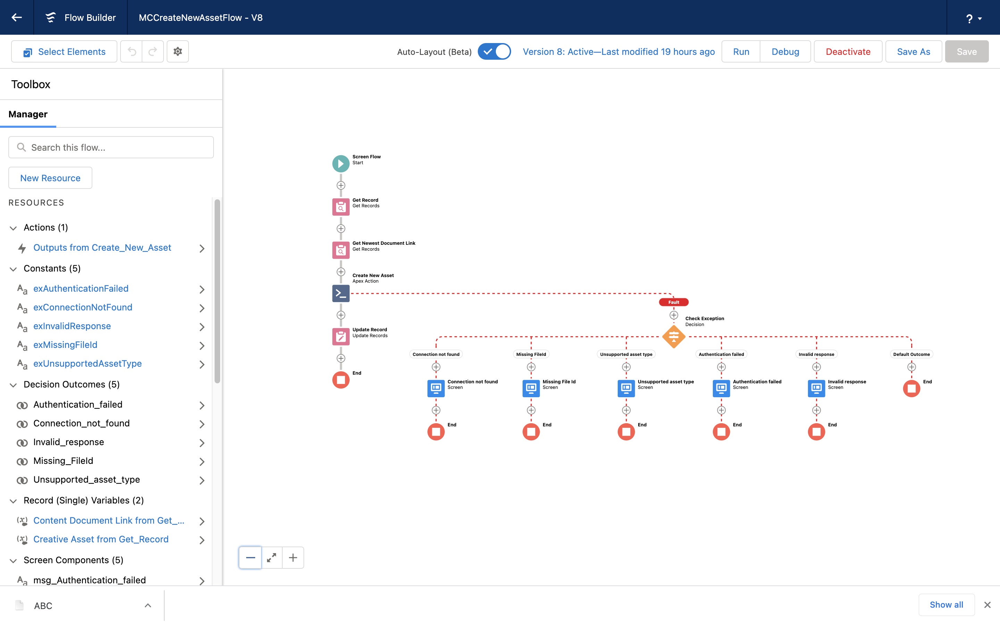

# Salesforce Integration with Marketing Cloud

[](https://github.com/tegeling/MarketingCloudAssetConnector/actions/workflows/scratch-org-sfdx-ci-master.yml)
[](https://codecov.io/gh/tegeling/MarketingCloudAssetConnector)

Upload file assets from Salesforce Core to Marketing Cloud. It contains an Apex Action for Flows to call Salesforce Marketing Cloud Rest API.

# Setup and Configuration Steps

## Deploy Metadata

### Installing the app using a Scratch Org

1. Set up your environment including:

   - Enable Dev Hub in your Trailhead Playground
   - Install Salesforce CLI
   - Install Visual Studio Code
   - Install the Visual Studio Code Salesforce extensions

1. If you haven't already done so, authorize your hub org and provide it with an alias (**devhub** in the command below):

   ```
   sfdx auth:web:login -d -a devhub
   ```

1. Clone the MarketingCloudAssetConnector repository:

   ```
   git clone https://github.com/tegeling/MarketingCloudAssetConnector
   cd MarketingCloudAssetConnector
   ```

1. Create a scratch org and provide it with an alias (**MCAssetConnector** in the command below):

   ```
   sfdx force:org:create -s -f config/project-scratch-def.json -a MCAssetConnector
   ```

1. Push the app to your scratch org:

   ```
   sfdx force:source:push
   ```

1. Assign the **MCAssetConnectorPerm** permission set to the default user:

   ```
   sfdx force:user:permset:assign -n MCAssetConnectorPerm
   ```

1. Open the scratch org:

   ```
   sfdx force:org:open
   ```

### Installing the app using an Unlocked Package

Follow this set of instructions if you want to deploy the app to a more permanent environment than a Scratch org or if you don't want to install the local developement tools. You can use a non source-tracked orgs such as a free [Developer Edition Org](https://developer.salesforce.com/signup) or a [Trailhead Playground](https://trailhead.salesforce.com/).

Make sure to start from a brand-new environment to avoid conflicts with previous work you may have done.

1. Log in to your org

1. Click [https://login.salesforce.com/packaging/installPackage.apexp?p0=04t5I000001eewrQAA](https://login.salesforce.com/packaging/installPackage.apexp?p0=04t5I000001eewrQAA) to install the MarketingCloudAssetConnector unlocked package in your org.

1. Select **Install for All Users**

1. In App Launcher, click **View All** then select the **Creative Assets** tab.

## Configure Connection Settings

### Enter Marketing Cloud connection settings as custom metadata

Use Custom Metadata Type **MCConnectionSetting** to enter your specific connection settings like subdomain, client_id, client_secret and account_id
You get the relevant settings from your Marketing Cloud API Integration configuration.

- Copy your subdomain value from either Authentication Base URI or REST Base URI. For example: from https://mc120345679012-abcdefghi-key.auth.marketingcloudapis.com/ just copy **mc120345679012-abcdefghi-key**
- Copy Client Id
- Copy Client Secret
- Copy Account Id

Open Custom Metadata Types in Salesforce Setup:


Open Manage Records for MCConnectionSetting, add a record with New.
Give your record a Label and MCConnectionSetting Name (like MC) and enter your values from above.


If you miss this step and your configuration is not found, you will see `"System.QueryException: List has no rows for assignment to SObject"` error.

### Authorize endpoints with Remote Site Settings

This connector code uses Rest callouts to Marketing Cloud service endpoints.
You need to authorize these endpoints to allow access to Marketing Cloud.
Note: This connector does not use Named Credentials.

- **MC_AUTH** Endpoint - edit and paste your Authentication Base URI from your Marketing Cloud settings
- **MC_REST** Endpoint - edit and paste your REST Base URI from your Marketing Cloud settings


If you miss this step, you will see `"System.CalloutException: Unauthorized endpoint, please check Setup->Security->Remote site settings. endpoint = https://mc120345679012-abcdefghi-key.auth.marketingcloudapis.com/v2/token"` errors.

## Creative Assets and upload steps

This connector deploys a custom object named **Creative Asset**, but you can use any object with a related File.
Create a new sample record and upload a file.


This object has a Quick Action button named **Upload Creative Asset** to invoke a Flow named **MCCreateNewAssetFlow**. You can change and edit this flow to adopt your specific requirements.



The flow contains an Apex Action named **Create New Asset**. This action invokes the Apex invocable method in class MCCreateNewAssetCallout.
You can configure the following input parameters:
| Label | Type | Description | Required/Optional |
|---------------|---------------|------------------------------|--------------------|
| Connection | `String` | Connection settings as defined in Custom Metadata `MCConnectionSetting` | Required |
| File ID | `ID` | Salesforce record ID of the new file | Required |
| Asset Name | `String` | Name of the asset, set by the client. 200 character maximum | Required |
| Category Name | `String` | Name of the category/folder, where the asset is stored. Default is root folder | Optional |
| Customer Key | `String` | Reference to customers private ID/name for the asset | Optional |
| Description | `String` | Description of the asset, set by the client | Optional |
| Version | `Integer` | The version of the asset | Optional |
| Asset Type | `String` | The type of the asset (png, gif, jpg) | Optional |
| Asset File Name | `String` | The name of the asset file | Optional |

If you don't specify optional parameters, the code is using the referenced filename, extension and version as input parameters.

The Apex Action returns the following fields as a a result from the asset creation:
| Label | Type | Description |
|---------------|---------------|------------------------------|
| Internal ID | `String` | Internal Marketing Cloud Identifier |
| Published URL | `String` | Asset is available at this URL |
| Status | `String` | Asset Status |
| Published Datetime | `Datetime` | Asset publication date and time |
| File Size | `Integer` | Asset file size |
| Asset Width | `Integer` | Asset pixel width |
| Asset Height | `Integer` | Asset pixel height |

# Additional references

Postman Collection
https://developer.salesforce.com/blogs/2021/04/explore-the-salesforce-marketing-cloud-apis-with-a-postman-collection.html

Marketing Cloud API documentation
https://developer.salesforce.com/docs/atlas.en-us.noversion.mc-apis.meta/mc-apis/routes.htm#detail_CreateAsset
